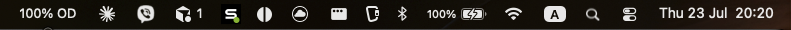
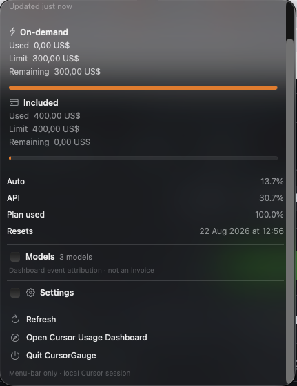

# CursorGauge

**Cursor usage and spend, at a glance.**

macOS menu-bar app for your signed-in Cursor plan — spending pools next to the clock, details one click (or hotkey) away.

<p>
  
  
</p>



> Not affiliated with Cursor / Anysphere. Uses unofficial local-session + usage APIs that can change.

## ✨ Features

- 📊 Compact status: `C 16% · O 31%` (Cursor / Other Models), then `OD 82%` / `$xx OD` when on-demand actually spends
- ⌨️ **⌥⌘C** opens the panel even if the icon is crowded out of the menu bar
- 💳 Spending-page pools (used bars) + on-demand remaining bar (full when unused)
- 🤖 Per-model spend for the current billing cycle
- ⚙️ `$` / `%` OD display when on-demand is active; optional Launch at Login
- 🔒 Uses your existing Cursor login — no pasted tokens, no telemetry

## 🚀 Install

1. Grab the latest **arm64** zip from [Releases](https://github.com/marko999/cursor-gauge/releases)
2. Unzip → right-click `CursorGauge.app` → **Open** (ad-hoc signed, not notarized)
3. Optional: move it to `/Applications` (needed for reliable Launch at Login)

Quit from the panel, or `pkill -x CursorGauge`.

## 🔐 Privacy (short)

- Reads Cursor’s local session on this Mac only
- Talks only to Cursor hosts (`api2.cursor.sh`, `cursor.com`)
- Nothing is sent to this repo’s authors

Details: [SECURITY.md](SECURITY.md)

## 🛠️ Build

```bash
make test && make app
open dist/CursorGauge.app
```

See [CONTRIBUTING.md](CONTRIBUTING.md).

## ⚠️ Notes

- Needs Cursor signed in on this Mac
- Apple Silicon (arm64) for the published zip
- Unofficial APIs — may break after Cursor updates

## License

MIT — see [LICENSE](LICENSE)
